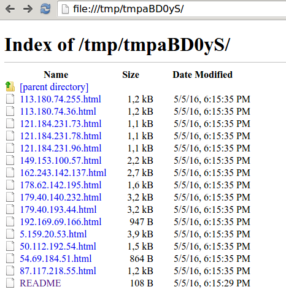

Python code to query the Censys public scan database.
This script is made around library censys-python (https://github.com/Censys/censys-python)
and is inteded to make censys queries quick & easy from command-line.

- [Requirements](#requirements)
- [Usage](#usage)
- [Examples](#examples)
  * [Generic query IP or host (look for anything matching the string in Censys indexed data)](#generic-query-ip-or-host-look-for-anything-matching-the-string-in-censys-indexed-data)
  * [Count how much web servers have 'SAP' in their `Server` header](#count-how-much-web-servers-have-sap-in-their-server-header)
  * [Get geo reparition of server with 'ABAP' in their `Server` header](#get-geo-reparition-of-server-with-abap-in-their-server-header)
  * [Retrieve the hosts that have SSL certificate with organization 'Whatsapp'](#retrieve-the-hosts-that-have-ssl-certificate-with-organization-whatsapp)
  * [Printing raw JSON record from database for a specific request](#printing-raw-json-record-from-database-for-a-specific-request)
  * [Listing example of fields we only want to dump in the records](#listing-example-of-fields-we-only-want-to-dump-in-the-records)
  * [Export to disk sites frontpage containing "Hacked by" in their title](#export-to-disk-sites-frontpage-containing-hacked-by-in-their-title)
  * [Use tags provided by censys scanner to look at servers that need to be secured](#use-tags-provided-by-censys-scanner-to-look-at-servers-that-need-to-be-secured)

## Requirements


You need to create an account on https://censys.io and get your
API key and secret at https://censys.io/account

Important note: your queries will be throttled.
What is allowed is 0.2 tokens/second (60.0 per 5 minute bucket).

`$ pip install censys-python`

## Usage


``` bash
$ censys_io.py --help
usage: censys_io.py [-h] [-m MATCH] [-f FILTER] [--count] [-r REPORT]
                    [-B REPORT_BUCKET] [-a ASN] [-c COUNTRY] [-o CERT_ORG]
                    [-i CERT_ISSUER] [-s CERT_HOST] [-S HTTP_SERVER]
                    [-t HTML_TITLE] [-b HTML_BODY] [-T TAGS] [--api_id API_ID]
                    [--api_secret API_SECRET] [-d] [-v] [-l LIMIT] [-H]
                    [--tsv]
                    [arguments [arguments ...]]

Censys query via command line

-- gelim

positional arguments:
  arguments             Censys query

optional arguments:
  -h, --help            show this help message and exit
  -m MATCH, --match MATCH
                        Highlight a string within an existing query result
  -f FILTER, --filter FILTER
                        Filter the JSON keys to display for each result (use value 'help' for interesting fields)
  --count               Print the count result and exit
  -r REPORT, --report REPORT
                        Stats on given field (use value 'help' for listing interesting fields)
  -B REPORT_BUCKET, --report_bucket REPORT_BUCKET
                        Bucket len in report mode (default: 50)
  -a ASN, --asn ASN     Filter with ASN (ex: 36040 for Google Inc.)
  -c COUNTRY, --country COUNTRY
                        Filter with country
  -o CERT_ORG, --cert-org CERT_ORG
                        Cert issued to org
  -i CERT_ISSUER, --cert-issuer CERT_ISSUER
                        Cert issued by org
  -s CERT_HOST, --cert-host CERT_HOST
                        hostname cert is issued to
  -S HTTP_SERVER, --http-server HTTP_SERVER
                        Server header
  -t HTML_TITLE, --html-title HTML_TITLE
                        Filter on html page title
  -b HTML_BODY, --html-body HTML_BODY
                        Filter on html body content
  -T TAGS, --tags TAGS  Filter on specific tags. E.g: -T tag1,tag2,... (use keyword 'list' to list usual tags
  --api_id API_ID       Censys API ID (optional if no env defined
  --api_secret API_SECRET
                        Censys API SECRET (optional if no env defined)
  -d, --debug           Debug informations
  -v, --verbose         Print raw JSON records
  -l LIMIT, --limit LIMIT
                        Limit to N results
  -H, --html            Renders html elements in a browser
  --tsv                 Export result of search in TSV format
```

For full details about the formatting rules for `arguments` see search syntax in page
https://censys.io/ipv4/help?q=x%3Ax

For a quick and dirty test, you can build queries like:
- `foo AND bar` (will do a smart search by checking all keys with value foo and bar)
- `path.to.key:foo`
- `key:foo` (shortcut of previous, but will give strange results if there are collision with other keys)
- `key:/regex/` (regexp support via operator '/')
- `key:"long string with spaces"` (need to quote those strings)
- `key:[200 TO 300]` (int range queries)
- `key:192.168.0.0/24` (IP range query)

### Note about looking for substrings

Censys is backed by Elasticsearch, plus they filter the requests for
performance reasons.

If you want to look for all values beginning with the string
`Whatsapp`, you can look for `key:Whatsapp*`. If you look only for
`key:Whatsapp` you will get only fields that where analyzed (strings
cut into pieces depending on language rules, specific tokens, etc.)
and contains facets with the exact string "Whatsapp".

An example to highlight that is the values stored in the key
`443.https.tls.certificate.parsed.subject.organization`. By looking for `443.https.tls.certificate.parsed.subject.organization:Whatsapp` you will find ~90 results. Those will be entries with values:
- `WhatsApp Inc.`
- `WhatsApp Company Ltd`
- `WhatsApp`

But you will miss the values `WhatsApp, Inc.` that has ~350
entries. If we check censys.io "Data definitions" this field should be
analyzed as a "String" and the comma should be removed by the
tokenizer but something is not working as expecting.

So you need to be very careful when looking for substrings and try
different methods by either doing wildcards search (beware that Censys
disable beginning search term with a wildcard) or by using pure regexp
like "/.*Whatsapp.*/".

## Examples
### Generic query IP or host (look for anything matching the string in Censys indexed data)

Let's search for IP entries that contain the string "nmap" in one of
their keys.

``` shell
$ censy_io.py --limit 20 nmap
Number of results: 1002
5.196.225.134   Title: N/A                                        SSL: dawidstachowiak.pl                           AS: OVH, (16276)                        Loc: FR /                     OS: N/A        Tags: http, ssh, https
74.115.246.29   Title: BrainDump                                  SSL: philmcclure.duckdns.org                      AS: ENERGIZE (19215)                    Loc: US / Pulaski             OS: N/A        Tags: http, ssh, https
104.237.156.37  Title: Starlight Networking Security Lab          SSL:                                              AS: LINODE-AP (63949)                   Loc: US / Absecon             OS: N/A        Tags: http, ssh
69.160.84.231   Title: N/A                                        SSL:                                              AS: FIBER (5048)                        Loc: US / Orem                OS: CentOS     Tags: http, ssh
45.79.82.183    Title: nweb.io                                    SSL: nweb.io                                      AS: LINODE-AP (63949)                   Loc: US / Absecon             OS: N/A        Tags: http, ssh, https
60.32.137.218   Title: Kyodo2.0 Digital-Lab News Map Project      SSL: localhost.localdomain                        AS: OCN (4713)                          Loc: JP / Tokyo               OS: Fedora     Tags: dhe-export, rsa-export, http, https
104.237.129.231 Title: Ninja.Style                                SSL:                                              AS: LINODE-AP (63949)                   Loc: US / Absecon             OS: Ubuntu     Tags: http, ssh
192.109.14.42   Title: PASA Pallas                                SSL: pasa.pallas.com                              AS: PALLAS-AS, (24861)                  Loc: DE /                     OS: N/A        Tags: http, https
45.33.32.156    Title: Go ahead and ScanMe!                       SSL:                                              AS: LINODE-AP (63949)                   Loc: US / Absecon             OS: Ubuntu     Tags: http, ssh
104.224.137.222 Title:                                            SSL:                                              AS: IT7NET (25820)                      Loc: US / Phoenix             OS: CentOS     Tags: http
119.81.35.59    Title: SL Labs                                    SSL:                                              AS: SOFTLAYER (36351)                   Loc: SG / Singapore           OS: CentOS     Tags: http
81.27.98.98     Title: Check for Web Servers and more             SSL:                                              AS: UK-NETCETERA (24851)                Loc: GB /                     OS: Debian     Tags: http
212.237.16.237  Title: Infosec Notes                              SSL: 2d8.ru                                       AS: ARUBA-ASN, (31034)                  Loc: DK /                     OS: Ubuntu     Tags: http, smtp, https
198.23.94.99    Title: SL Labs                                    SSL:                                              AS: SOFTLAYER (36351)                   Loc: US / San Jose            OS: CentOS     Tags: http
77.109.162.35   Title: Citrin Toolbox                             SSL:                                              AS: INIT7, (13030)                      Loc: CH /                     OS: N/A        Tags: http
121.42.165.133  Title:                                            SSL:                                              AS: CNNIC-ALIBABA-CN-NET-AP (37963)     Loc: CN / Hangzhou            OS: CentOS     Tags: http, ssh
169.55.196.202  Title: SL Labs                                    SSL:                                              AS: SOFTLAYER (36351)                   Loc: US /                     OS: CentOS     Tags: http
119.81.209.6    Title: SL Labs                                    SSL:                                              AS: SOFTLAYER (36351)                   Loc: SG / Singapore           OS: CentOS     Tags: http
216.59.36.36    Title: Wait, wha?                                 SSL:                                              AS: IMMEDION (15085)                    Loc: US / Greenville          OS: N/A        Tags: http
204.152.250.58  Title: My Blog                                    SSL:                                              AS: BCC-65-182-96-0-PHX (33055)         Loc: US / Phoenix             OS: N/A        Tags: http
```
### Count how much web servers have 'SAP' in their `Server` header

``` shell
$ censys_io.py -S SAP --count
3299
```

### Get geo reparition of server with 'ABAP' in their `Server` header

``` shell
$ censys_io.py -S ABAP --report location.country.raw --report_bucket 10
Number of results: 602
count           raw
159             United States
90              Germany
30              Brazil
27              Italy
25              India
20              Australia
18              Canada
16              Denmark
16              Republic of Korea
16              Spain
```

### Retrieve the hosts that have SSL certificate with organization 'Whatsapp'

```
$ censys_io.py --cert-org "Whatsapp*" --limit 10
Number of results: 456
104.236.63.164  Title: phpinfo()                                  SSL: web.whatsapp.com                             AS: DIGITALOCEAN-ASN-NY3 (393406)       Loc: US / New York            OS: Ubuntu     Tags: http, ssh, https
169.55.74.44    Title: N/A                                        SSL: *.whatsapp.net + *.whatsapp.net              AS: SOFTLAYER (36351)                   Loc: US /                     OS: N/A        Tags: https
169.55.69.140   Title: N/A                                        SSL: *.whatsapp.net + *.whatsapp.net              AS: SOFTLAYER (36351)                   Loc: US /                     OS: N/A        Tags: https
169.45.71.55    Title: N/A                                        SSL: *.whatsapp.net + *.whatsapp.net              AS: SOFTLAYER (36351)                   Loc: NL /                     OS: N/A        Tags: https
169.45.71.118   Title: N/A                                        SSL: *.whatsapp.net + *.whatsapp.net              AS: SOFTLAYER (36351)                   Loc: NL /                     OS: N/A        Tags: https
169.54.210.17   Title: N/A                                        SSL: *.whatsapp.net + *.whatsapp.net              AS: SOFTLAYER (36351)                   Loc: US /                     OS: N/A        Tags: https
169.55.235.181  Title: N/A                                        SSL: *.whatsapp.net + *.whatsapp.net              AS: SOFTLAYER (36351)                   Loc: US /                     OS: N/A        Tags: https
169.45.71.42    Title: N/A                                        SSL: *.whatsapp.net + *.whatsapp.net              AS: SOFTLAYER (36351)                   Loc: NL /                     OS: N/A        Tags: https
158.85.5.217    Title: N/A                                        SSL: *.whatsapp.net + *.whatsapp.net              AS: SOFTLAYER (36351)                   Loc: US / Chantilly           OS: N/A        Tags: https
177.75.8.102    Title: N/A                                        SSL: *.whatsapp.net + *.whatsapp.net              AS: Networld Provedor e Servicos de Internet Ltda, BR (28178)Loc: BR /                     OS: N/A        Tags: https
```

### Printing raw JSON record from database for a specific request
```
$ censys_io.py ip:8.8.8.8 --verbose
Number of results: 1
{u'53': {u'dns': {u'lookup': {u'additionals': [],
                              u'answers': [{u'name': u'c.afekv.com',
                                            u'response': u'192.150.186.1',
                                            u'type': u'A'},
                                           {u'name': u'c.afekv.com',
                                            u'response': u'74.125.76.6',
                                            u'type': u'A'}],
                              u'authorities': [],
                              u'errors': False,
                              u'metadata': {},
                              u'open_resolver': True,
                              u'questions': [{u'name': u'c.afekv.com',
                                              u'type': u'A'}],
                              u'resolves_correctly': True,
                              u'support': True}}},
 u'autonomous_system': {u'asn': 15169,
                        u'country_code': u'',
                        u'description': u'GOOGLE - Google Inc., US',
                        u'name': u'GOOGLE',
                        u'organization': u'Google Inc., US',
                        u'path': [15169],
                        u'rir': u'unknown',
                        u'routed_prefix': u'8.8.8.0/24'},
 u'ip': u'8.8.8.8',
 u'location': {u'city': u'Mountain View',
               u'continent': u'North America',
               u'country': u'United States',
               u'country_code': u'US',
               u'latitude': 37.386,
               u'longitude': -122.0838,
               u'postal_code': u'94040',
               u'province': u'California',
               u'registered_country': u'United States',
               u'registered_country_code': u'US',
               u'timezone': u'America/Los_Angeles'},
 u'metadata': {},
 u'protocols': [u'53/dns'],
 u'tags': [],
 u'updated_at': u'2016-06-02T06:50:30+00:00'}
```

### Listing example of fields we only want to dump in the records

```
$ censys_io.py -f list
['location.country',
 'location.country_code',
 'location.city',
 'ip',
 'protocols',
 'autonomous_system.name',
 'autonomous_system.asn',
 '443.https.tls.certificate.parsed.subject.organization',
 '443.https.tls.certificate.parsed.subject.common_name',
 '443.https.tls.certificate.parsed.extensions.subject_alt_name.dns_names',
 '993.imaps.tls.tls.certificate.parsed.subject.common_name',
 '993.imaps.tls.tls.certificate.parsed.subject.organization',
 '80.http.get.title',
 '80.http.get.headers.server',
 '80.http.get.body',
 'metadata.os',
 'tags']
```

### Export to disk sites frontpage containing "Hacked by" in their title

```
$ censys_io.py --html-title "Hacked by" --limit 20 --html
Number of results: 1044
185.71.217.66   Title: Hacked By                                  SSL:                                              AS: SSDHOSTING, (201534)                Loc: CY /                     OS: Unix       Tags: pop3, ftp, http, pop3s, smtp, imap, imaps
45.55.207.28    Title: Hacked By M.e-dz &#8211; Hacked By M.e-dz  SSL:                                              AS: DIGITALOCEAN-ASN (14061)            Loc: US / New York            OS: Ubuntu     Tags: http, ssh
190.156.247.34  Title: hacked by suliman_hacker &#8211; hack[...] SSL:                                              AS: Telmex Colombia S.A., CO (10620)    Loc: CO /                     OS: Ubuntu     Tags: http
206.225.85.55   Title: Hacked By NorilaClasse | Hacked By No[...] SSL:                                              AS: CODERO-DFW (18501)                  Loc: US / Overland Park       OS: Ubuntu     Tags: ftp, http, ssh
69.89.28.35     Title: Hacked by bl4ck_cod3 | Hacked by bl4c[...] SSL: www.phliworldwide.com                        AS: UNIFIEDLAYER-AS-1 (46606)           Loc: US / Provo               OS: N/A        Tags: pop3, ftp, http, ssh, https, pop3s, imap, imaps
188.215.244.170 Title: Hacked by Ashura - Hacked by Ashura        SSL: rohc.ro + rohc.ro+                           AS: GTSCE (5588)                        Loc: RO /                     OS: N/A        Tags: pop3, ftp, http, https, pop3s, imap, imaps
95.213.235.31   Title: Hacked by ZeDaN-Mrx | Hacked by ZeDaN-Mrx  SSL:                                              AS: SELECTEL, (49505)                   Loc: RU /                     OS: Ubuntu     Tags: http, ssh
216.247.60.144  Title: Hacked By DeathCreppy Death-Stalkers [...] SSL: technology4vision.com + technology4vision.com+AS: PEER1 (13768)                       Loc: US / Atlanta             OS: N/A        Tags: pop3, ftp, http, ssh, https, pop3s, imap, imaps
149.56.147.247  Title: Hacked by zakiloup &#8211; Hacked by [...] SSL: savilerowtailors.ca + savilerowtailors.ca+   AS: OVH, (16276)                        Loc: US / Anaheim             OS: N/A        Tags: pop3, ftp, http, ssh, https, imap, imaps
216.235.2.38    Title: Hacked by CoLDHaCKeR , Hacked by Sensi     SSL:                                              AS: E-GATE-COMMUNICATIONS (13657)       Loc: CA / Toronto             OS: FreeBSD    Tags: ftp, http
31.14.23.187    Title: Hacked by Ashura | Hacked by Ashura        SSL: e-techdevelopment.ro + e-techdevelopment.ro+ AS: GTSCE (5588)                        Loc: RO /                     OS: N/A        Tags: pop3, ftp, http, https, pop3s, imap, imaps
188.215.244.141 Title: Hacked by Ashura &#8211; Hacked by Ashura  SSL: bisericafloresti.ro + bisericafloresti.ro+   AS: GTSCE (5588)                        Loc: RO /                     OS: N/A        Tags: pop3, ftp, http, https, pop3s, imap, imaps
118.96.152.47   Title: Hacked By $!R05                            SSL:                                              AS: TELKOMNET-AS2-AP (17974)            Loc: ID / Magelang            OS: N/A        Tags: http, ssh
207.7.94.210    Title: Hacked by Katib                            SSL: pureinternet.com.au + pureinternet.com.au+   AS: PRIVATESYSTEMS (63410)              Loc: US / Los Angeles         OS: N/A        Tags: pop3, ftp, http, https, pop3s, imap, imaps
209.29.150.141  Title: Hacked By GHoST61                          SSL: www.snakeoil.dom                             AS: ASN852 (852)                        Loc: CA /                     OS: Unix       Tags: ftp, dhe-export, rsa-export, http, https
46.229.175.179  Title: HaCKeD By PoLoNia WwW.NeTSaW.OrG           SSL:                                              AS: ADVANCEDHOSTERS-AS, (39572)         Loc: US /                     OS: Unix       Tags: ftp, http, ssh
71.18.197.222   Title: Hacked By #nof34rPT                        SSL: *.opentransfer.com + *.opentransfer.com+     AS: OPENTRANSFER-ECOMMERCE (32392)      Loc: US / Columbus            OS: N/A        Tags: ftp, http, https
88.198.101.66   Title: Hacked By Cyb3r Gl@diat0rs                 SSL:                                              AS: HETZNER-AS, (24940)                 Loc: DE /                     OS: Debian     Tags: http, ssh
176.226.210.113 Title: Hacked by Mr.Sh4hz3b-HaXoR                 SSL:                                              AS: INTERSVYAZ-AS (8369)                Loc: RU / Kurgan              OS: N/A        Tags: http
129.121.106.11  Title:  HaCked By virus3033                       SSL:                                              AS: NEXCESS-NET (36444)                 Loc: US / Redwood City        OS: N/A        Tags: ftp, http
```

We then can browse `/tmp/tmpx5HjqB` like in 

Content is available in key '80.http.get.body' and saved to disk for
offline analysis.  **Beware** of malicious content that could be
viewed from the browser. No filtering is done on the content stored
on disk.

### Use tags provided by censys scanner to look at servers that need to be secured

```
$ censys_io.py --tags heartbleed --report location.country.raw
Number of results: 213034
46565     United States
26009     China
12383     Germany
8138      India
8004      Russia
6471      United Kingdom
6111      France
5817      Italy
5387      Republic of Korea
5257      Japan
```
